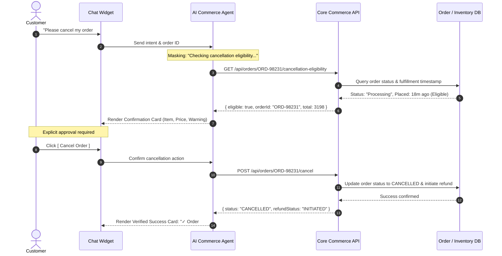

# AI Commerce Agent — Comprehensive Design Specification & System Document

> **Document Version:** 1.0.0  
> **Status:** Approved / Specification Baseline  
> **Applies to:** Customer Web Experience, Mobile Web / PWA, Storefront Integrations, and Customer Support Admin Console  
> **Target Audience:** Frontend Engineers, Backend/AI Engineers, UX/UI Designers, Product Managers, QA Engineers

---

## 1. Product Vision & Philosophy

### 1.1 Executive Summary
The **AI Commerce Agent** is the 24/7 digital personal shopper and customer-service concierge for the modern luxury clothing e-commerce platform. It transforms the shopping journey from passive browsing into an interactive, high-touch editorial consultation.

Rather than presenting itself as a novelty chatbot, the assistant operates as an invisible, intelligent layer over the storefront—assisting customers in:
- Discovering apparel through natural conversational queries and aesthetic descriptions.
- Understanding sizing, fit, fabric care, and collection pairings.
- Managing cart contents and saved wishlist items directly inside the conversation stream.
- Tracking shipment milestones and reviewing order histories in real time.
- Performing deterministic, verified transactions (order cancellations, return requests, address modifications) with zero guesswork.
- Navigating store policies (shipping, returns, exchanges, sizing guides).
- Gracefully transitioning to human customer care agents with full session context when required.

### 1.2 Core Design Principles

| Principle | Meaning & Application | Anti-Pattern |
| :--- | :--- | :--- |
| **Aesthetic Subordination** | The assistant is secondary to the clothes. The UI uses editorial restraint: monochrome tones, crisp typography, generous whitespace. | "AI Purple" gradients, glowing neon borders, cartoonish robot avatars, futuristic particle effects. |
| **Conversational Commerce, Not AI Novelty** | Feels like *"Ask me anything about your shopping experience"* rather than *"Here is an artificial intelligence interface."* | Showing internal prompts, tool names, technical errors, or token generation metrics to the customer. |
| **Deterministic Action Verifiability** | All actions (cancellations, returns, inventory checks) reflect real-time backend state. The assistant never speculates. | Hallucinating confirmation: *"Your order should probably be cancelled."* |
| **Progressive Disclosure** | Clean messages with contextual rich media cards (Product, Order, Confirmation) inserted only when relevant. | Dumping walls of unstructured text or JSON blobs into the chat window. |
| **Frictionless Transitions** | Smooth micro-animations, instant optimistic UI responses, and zero interruption of the checkout flow. | Full-page lockouts, blocking modals, or laggy rendering. |

---

## 2. Design Tokens & Visual Language System

The AI Commerce Agent strictly inherits the brand’s existing editorial identity: clean, minimal, monochrome, spacious, and typographic.

```
       #FFFFFF (Background)
          │
          ├── #111111 (Primary Text & Key CTA)
          ├── #666666 (Secondary & Metadata)
          ├── #E5E5E5 (Hairline Borders)
          └── #F7F7F7 (Muted Surfaces / Assistant Bubbles)
```

### 2.1 CSS Custom Properties (Theme Tokens)

```css
:root {
  /* Surface & Background Colors */
  --agent-bg-primary: #FFFFFF;
  --agent-bg-surface: #F7F7F7;
  --agent-bg-surface-hover: #EFEFEF;
  --agent-bg-backdrop: rgba(0, 0, 0, 0.45);
  
  /* Text & Foreground Colors */
  --agent-text-primary: #111111;
  --agent-text-secondary: #666666;
  --agent-text-tertiary: #999999;
  --agent-text-inverse: #FFFFFF;

  /* Borders & Dividers */
  --agent-border-color: #E5E5E5;
  --agent-border-subtle: #F0F0F0;
  --agent-border-focus: #111111;

  /* Semantic Feedback Tokens */
  --agent-status-success-bg: #ECFDF5;
  --agent-status-success-text: #065F46;
  --agent-status-success-border: #A7F3D0;
  
  --agent-status-warning-bg: #FFFBEB;
  --agent-status-warning-text: #92400E;
  --agent-status-warning-border: #FDE68A;
  
  --agent-status-error-bg: #FEF2F2;
  --agent-status-error-text: #991B1B;
  --agent-status-error-border: #FECACA;

  --agent-status-online: #10B981;

  /* Typography */
  --agent-font-family: 'Inter', 'Geist', 'Plus Jakarta Sans', 'Manrope', -apple-system, BlinkMacSystemFont, 'Segoe UI', Roboto, sans-serif;
  --agent-font-size-title: 19px;
  --agent-font-size-body: 14px;
  --agent-font-size-small: 13px;
  --agent-font-size-meta: 12px;
  --agent-font-size-micro: 11px;
  
  --agent-line-height-tight: 1.25;
  --agent-line-height-normal: 1.5;
  --agent-line-height-relaxed: 1.65;

  /* Radii */
  --agent-radius-panel: 20px;
  --agent-radius-card: 14px;
  --agent-radius-bubble: 16px;
  --agent-radius-pill: 9999px;
  --agent-radius-button: 8px;

  /* Elevation & Shadows */
  --agent-shadow-floating: 0 12px 40px -8px rgba(0, 0, 0, 0.12), 0 4px 16px -4px rgba(0, 0, 0, 0.06);
  --agent-shadow-card: 0 2px 8px rgba(0, 0, 0, 0.04);
  --agent-shadow-dropdown: 0 8px 24px rgba(0, 0, 0, 0.08);

  /* Transitions */
  --agent-transition-fast: 150ms cubic-bezier(0.16, 1, 0.3, 1);
  --agent-transition-normal: 250ms cubic-bezier(0.16, 1, 0.3, 1);
  --agent-transition-bounce: 350ms cubic-bezier(0.34, 1.56, 0.64, 1);

  /* Dimensions */
  --agent-desktop-width: 440px;
  --agent-desktop-height: 680px;
  --agent-launcher-size: 64px;
  --agent-viewport-margin: 24px;
  --agent-z-index: 9999;
}
```

### 2.2 Typography Scale & Specs

| Role | Font Size | Weight | Line Height | Tracking | Usage |
| :--- | :--- | :--- | :--- | :--- | :--- |
| **Panel Header Title** | 18px–20px | 600 (SemiBold) | 1.25 | -0.015em | Top bar title: "Personal Shopping Assistant" |
| **Card Header / Price** | 15px–16px | 600 (SemiBold) | 1.3 | -0.01em | Product names, total amounts, order headers |
| **Message Body** | 14px–15px | 400 (Regular) | 1.55 | normal | Assistant and customer chat messages |
| **Interactive Buttons** | 13px–14px | 500 (Medium) | 1.3 | +0.01em | Action buttons ("Add to Cart", "View Order") |
| **Metadata / Timestamps** | 12px | 400 (Regular) | 1.4 | +0.01em | Timestamps, variant tags, status descriptions |
| **Stepper / Micro Labels** | 11px | 500 (Medium) | 1.2 | +0.02em | Tool execution step states, badge labels |

---

## 3. Structural Layout & Responsive Architecture

```
+-------------------------------------------------------------------------------+
|  STOREFRONT PAGE (Desktop)                                                    |
|                                                                               |
|                                            +-------------------------------+  |
|                                            | CHATBOT PANEL (Desktop)       |  |
|                                            | Width: 400-460px              |  |
|                                            | Height: 600-750px             |  |
|                                            | Margin: 24px from bottom/right|  |
|                                            |                               |  |
|                                            | [Header: Status, Close, Min]  |  |
|                                            |-------------------------------|  |
|                                            | [Conversation Stream Area]    |  |
|                                            |  - Editorial message bubbles  |  |
|                                            |  - Product / Order cards      |  |
|                                            |  - Deterministic steppers     |  |
|                                            |-------------------------------|  |
|                                            | [Contextual Suggestion Chips] |  |
|                                            |-------------------------------|  |
|                                            | [Input Textarea + Send CTA]   |  |
|                                            +-------------------------------+  |
|                                                     [ Floating Launcher ]     |
|                                                     (64x64px Bottom-Right)    |
+-------------------------------------------------------------------------------+
```

### 3.1 Desktop Viewport Implementation (>= 768px)
- **Positioning:** Fixed, bottom-right coordinates (`bottom: 24px; right: 24px;`).
- **Dimensions:** Width `420px` (clamped between `400px` and `460px`), Height `680px` (clamped to max `85vh`).
- **Surface Styling:** Border radius `20px`, 1px solid `var(--agent-border-color)`, background `var(--agent-bg-primary)`, shadow `var(--agent-shadow-floating)`.
- **Z-Index Layering:** Placed at `z-index: 9999` to float above storefront navigation, but dynamically positioned or masked to ensure checkout confirmation buttons and drawer toggles remain unblocked.

### 3.2 Mobile Viewport Implementation (< 768px)
- **Viewport Model:** Full-screen modal overlay (`100vw × 100dvh`).
- **Layout Behavior:**
  - Prevents background page scrolling (`overflow: hidden` on `body` when active).
  - Handles mobile virtual keyboards using the Modern `visualViewport` API:
    ```javascript
    window.visualViewport.addEventListener('resize', () => {
      const height = window.visualViewport.height;
      chatContainer.style.height = `${height}px`;
    });
    ```
  - Safe-area insets applied to top header (`padding-top: env(safe-area-inset-top)`) and bottom input bar (`padding-bottom: env(safe-area-inset-bottom)`).
- **Prohibited on Mobile:** Floating mini-windows, fixed 400px boxes with horizontal scrollbars, or overlays that pinch the keyboard.

---

## 4. Component Design Specifications

### 4.1 Floating Launcher Button

```
+-------------------------------------------+
| (64x64px)                                 |
|     +---------+                           |
|     |  * * *  |   ● (Green Presence Dot)  |
|     |  Concierge                          |
|     +---------+                           |
+-------------------------------------------+
```

- **Dimensions:** `64px × 64px`, circular (`border-radius: 50%`) or modern squircle (`border-radius: 18px`).
- **Color:** `#111111` background, `#FFFFFF` icon stroke.
- **Micro-Indicators:**
  - Online presence badge: `10px × 10px` green pill (`#10B981`) with a subtle white ring outline on top-right quadrant.
  - Unread message badge: Count pill (`#111111` text, `#FFFFFF` background, or inverse) with smooth entry animation.
- **States:**
  - Resting: Subtle scale (1.0), gentle drop shadow.
  - Hover: Scale to 1.05, cursor `pointer`, shadow deepens.
  - Active/Open: Morph or rotate icon smoothly into a close cross (`×`).

---

### 4.2 Chat Header Component

```
+-------------------------------------------------------------------+
|  [Avatar]  Personal Shopping Assistant                     [—] [×]|
|            ● Available                                            |
+-------------------------------------------------------------------+
```

- **Identity Display:** Configurable title ("Personal Shopping Assistant", "Style Assistant", or "Concierge").
- **Persona Transparency:** Never pretends to be a named real human (no fake human photos). A clean, editorial monogram or minimal concierge symbol is used.
- **Status Indicator:**
  - `● Available`: Real-time backend connection verified.
  - `○ Connecting...`: Re-establishing socket / SSE connection.
  - `● Support Mode`: Live human agent active.
- **Header Actions:**
  - `History Toggle` (Clock icon): Opens past conversations drawer for authenticated users.
  - `Minimize Button` (—): Collapses panel to launcher (desktop only).
  - `Close Button` (×): Closes panel with graceful fade-out.

---

### 4.3 Conversation Stream & Message Layout

```
Assistant Message (Left Aligned):
[Avatar]  We have found 3 items matching "Merino Wool Knit" in Size M.
          10:24 AM

User Message (Right Aligned):
          Do you have the charcoal grey one in stock?  [✓✓]
          10:25 AM
```

#### Assistant Message Styling:
- **Alignment:** Left-aligned, with avatar aligned to top.
- **Background:** Subtle muted tone (`#F7F7F7`).
- **Text:** `#111111`, font size `14px`, line-height `1.55`.
- **Borders & Radius:** Border radius `16px 16px 16px 4px`, no garish borders.
- **Markdown Rendering:** Supports clean bolding, bulleted lists, and clickable deep-links to site collections.

#### Customer Message Styling:
- **Alignment:** Right-aligned.
- **Background:** `#111111` (Brand Dark) or high-contrast clean surface with subtle border.
- **Text:** `#FFFFFF` (on dark) or `#111111` (on crisp light theme).
- **Radius:** Border radius `16px 16px 4px 16px`.
- **Timestamp:** Secondary metadata (`#999999`) aligned below bubble.

---

### 4.4 Reasoning Masking & Typing Indicators

**Strict Security & UX Rule:** Never expose chain-of-thought, internal system instructions, or raw reasoning to the customer.

Instead of generic pulsing dots, render context-aware status strings that reassure the user that real work is being done:

```
+-----------------------------------------------------------+
| (• • •)  Checking your order status with logistics...    |
+-----------------------------------------------------------+
```

```
+-----------------------------------------------------------+
| (• • •)  Searching current autumn catalog for linen...   |
+-----------------------------------------------------------+
```

#### Allowed Progress Messages:
- `"Checking your order status..."`
- `"Finding available products..."`
- `"Checking return eligibility..."`
- `"Preparing your bag..."`
- `"Connecting you to human support..."`

---

### 4.5 Tool Execution State (Deterministic Micro-Stepper)

When complex operations take place across multiple backend stages, a compact, clean status block communicates progress without leaking technical API payloads:

```
+-----------------------------------------------------------+
|  PROCESS: ORDER CANCELLATION                              |
|  ✓  Order #ORD-84920 found                                |
|  ✓  Cancellation eligibility verified (Within 60 min)     |
|  ... Processing cancellation with warehouse...            |
+-----------------------------------------------------------+
```

- **Visual Style:** Compact, inset container (`background: #FAFAFA; border: 1px solid #EAEAEA; border-radius: 8px; padding: 10px 14px;`).
- **Icons:** Minimal monochrome checks (`✓`) and a subtle spinning indicator for active steps.
- **Final Transition:** Once completed, collapses into a single clean success/failure notification.

---

### 4.6 Product Card Component

Designed for high-impact visual apparel presentation within the conversation flow:

```
+-----------------------------------------------------------+
| +---------------------+  Cashmere Oversized Sweater       |
| |                     |  ₹8,499                           |
| |   [Product Image]   |  Color: Heather Grey              |
| |       (4:5)         |  Size: S, M, L available          |
| |                     |  ★ 4.9 (42 reviews)               |
| +---------------------+                                   |
| [ Add to Bag ]                 [ View Details ]   [ ♡ ]   |
+-----------------------------------------------------------+
```

#### Specifications:
- **Image Container:** Fixed aspect ratio (`4:5` or `1:1`), `border-radius: 8px`, `object-fit: cover`. Always features real imagery, with placeholder skeleton states while loading.
- **Details:** Title (15px SemiBold), Price (15px Bold with currency formatting), Color/Variant badge, Stock status ("In Stock" / "Only 2 Left").
- **Card Actions:**
  - `Primary Action`: `[ Add to Bag ]` (Triggers optimistic cart counter update and feedback toast).
  - `Secondary Action`: `[ View Details ]` (Opens quick-view modal or navigates to PDP).
  - `Wishlist Toggle`: Heart icon (`♡` / `♥`) with immediate state toggle.

---

### 4.7 Order Card Component

Communicates order details and eligible actions deterministically:

```
+-----------------------------------------------------------+
| ORDER #ORD-98231                     Placed: Oct 02, 2026 |
| Status: Processing                   ● Within Edit Window |
|-----------------------------------------------------------|
| [Thumb] Heavyweight Boxy Tee (x2)                         |
|         Color: Vintage Black | Size: L                    |
|         Total: ₹3,198                                     |
|-----------------------------------------------------------|
| [ Track Package ]         [ Cancel Order ]     [ Support ]|
+-----------------------------------------------------------+
```

#### Action Governance:
- Action buttons (`Cancel Order`, `Request Return`, `Track Package`) are **ONLY** rendered when the backend response explicitly states `eligible: true`.
- If an order has shipped, `[ Cancel Order ]` is disabled or omitted, and replaced with `[ Track Shipment ]`.

---

### 4.8 Confirmation Card (Destructive Actions)

Destructive or financial operations (e.g., cancelling an order, removing saved addresses, initiating returns) must require explicit confirmation.

```
+-----------------------------------------------------------+
|  CONFIRM ORDER CANCELLATION                               |
|                                                           |
|  Are you sure you want to cancel Order #ORD-98231?        |
|  Heavyweight Boxy Tee (x2) - ₹3,198                       |
|                                                           |
|  Note: This action cannot be reversed. Refund of ₹3,198   |
|  will be processed to your original payment method.       |
|                                                           |
|  [ Cancel Order ]                  [ Keep Order ]         |
+-----------------------------------------------------------+
```

- **Primary Button:** High visual hierarchy with clear destructive text (`[ Cancel Order ]`).
- **Dismiss Button:** Neutral secondary button (`[ Keep Order ]`).
- **Execution:** Clicking `[ Cancel Order ]` disables both buttons, displays an inline spinner, and awaits backend confirmation.

---

### 4.9 Context-Aware Suggestion Chips

Horizontal scrolling pill chips placed immediately above the input bar to minimize typing friction:

```
[ Find black shirts ] [ Track my order ] [ Return policy ] [ Outfit ideas ] >
```

#### Context Adaptation Matrix:

| Current Shopper Context | Generated Suggestion Chips |
| :--- | :--- |
| **New Session / Homepage** | `"Find black shirts"`, `"Where is my order?"`, `"What's your return policy?"`, `"Help me style an outfit"` |
| **Product Detail Page (PDP)** | `"Is this true to size?"`, `"Show similar items"`, `"What fabric is this?"`, `"Add this to my bag"` |
| **Active Cart Page** | `"Can I get a discount code?"`, `"What are the shipping charges?"`, `"Help me checkout"` |
| **Order History Page** | `"Where is my package?"`, `"Can I cancel this order?"`, `"Start a return"`, `"Download invoice"` |

---

### 4.10 Input Bar & Keyboard Interaction

```
+---------------------------------------------------------------+
| [ + ]  Ask about sizing, styles, or your orders...      [ ↑ ] |
+---------------------------------------------------------------+
```

- **Expanding Textarea:** Starts at 44px height, auto-grows up to a maximum of 140px (approx. 5 lines) before enabling internal smooth scrolling.
- **Action Button (`[ ↑ ]`):** High contrast icon. Disabled when input is whitespace-only; turns solid black (`#111111`) when characters are present.
- **Future Extension Slots (`[ + ]`):** Extensible menu for Image Search (upload outfit photo) and Voice dictation.
- **Keyboard Shortcuts:**
  - `Enter`: Submit message.
  - `Shift + Enter`: Insert clean newline.
  - `Escape`: Close chatbot panel (desktop) or dismiss active modal.

---

### 4.11 Human Support Handoff Card

When an issue cannot be resolved by the agent or requires human discretion:

```
+---------------------------------------------------------------+
|  CONNECT WITH CUSTOMER CARE                                   |
|                                                               |
|  I will connect you directly with our concierge team.        |
|  Your conversation history will be shared so you won't have  |
|  to repeat yourself.                                          |
|                                                               |
|  Estimated wait time: ~3 minutes                              |
|                                                               |
|  [ Connect to Live Agent ]        [ Continue with Assistant ] |
+---------------------------------------------------------------+
```

---

## 5. State Machine & Execution Flows

### 5.1 End-to-End Action Verification Flow

The assistant strictly follows a 5-step transactional cycle to prevent hallucinations and maintain user trust:



### 5.2 Deterministic Error & Failure Handling

If an action cannot be completed, the interface renders humanized, backend-verified explanations. The assistant **never** invents speculative reasons:

| Backend Response | Prohibited AI Output (Bad) | Mandatory Approved Output (Good) |
| :--- | :--- | :--- |
| `ORDER_ALREADY_SHIPPED` | *"I think it might be too late to cancel."* | *"We couldn't cancel Order #ORD-98231 because it has already departed our warehouse. You can initiate a free return once it arrives."* |
| `ITEM_OUT_OF_STOCK` | *"The shirt seems unavailable."* | *"The Heavyweight Boxy Tee in Vintage Black (Size L) is currently sold out. Would you like me to notify you when it restocks?"* |
| `HTTP_500_TIMEOUT` | *"Internal Server Error in /api/v1/cart"* | *"I'm having trouble updating your bag right now. Please try again in a moment, or refresh the page."* |

---

## 6. Security, Privacy & Data Isolation UX

### 6.1 Customer Data Protection
1. **Session Isolation:**
   - Guest sessions utilize transient cryptographic session UUIDs stored in `sessionStorage`.
   - Authenticated sessions require valid JWT/OAuth2 bearer tokens. Cross-user conversation retrieval is blocked at the gateway level.
2. **Sanitization of AI Outputs:**
   - Raw stack traces, database schema names, internal microservice URLs, and raw tool invocation names (e.g., `execute_sql_query`, `stripe_refund_v2`) are intercepted by response middleware and **never** rendered into the DOM.
3. **Sensitive Data Masking:**
   - Credit card numbers, CVVs, and passwords are never accepted in chat. If detected via client-side regex, an immediate warning banner is shown and the input is sanitized before transmission.

---

## 7. Admin Observability & Support Console

While the customer sees an elegant, minimal editorial interface, the customer-service and engineering teams require full operational observability.

```
+-----------------------------------------------------------------------------------------------+
| ADMIN OPERATIONS CONSOLE                                                     Live Sessions: 42|
+-----------------------------------------------------------------------------------------------+
| CUSTOMER INFO           | CONVERSATION TIMELINE & AUDIT             | RAG & TOOL INSPECTOR    |
|                         |                                           |                         |
| Name: Priya Sharma      | [10:24:02] User: "Cancel my order"        | Tool: verify_order      |
| Email: priya@brand.com  | [10:24:03] Agent: Initiated eligibility   | Status: 200 OK          |
| Tier: VIP Gold          | [10:24:05] User: Clicked [Confirm Cancel] | Latency: 142ms          |
| Order: #ORD-98231       | [10:24:06] Backend: Order Cancelled       | Context: Refund Policy  |
|                         |                                           |                         |
| [ Take Over Session ]   | [ Send Staff Note ]                       | [ View Raw Logs ]       |
+-----------------------------------------------------------------------------------------------+
```

### 7.1 Admin Console Capabilities
- **Live Stream Audit:** Real-time visibility into active customer sessions with step-by-step tool execution telemetry.
- **RAG & Policy Attribution:** Displays the exact policy document chunks and confidence scores retrieved during the conversation.
- **One-Click Human Takeover:** Allows a support manager to pause the AI agent and converse directly with the shopper inside the existing chat window.
- **Escalation Triggers:** Automated alerts when negative sentiment, repeated failed tool calls, or explicit requests for a supervisor are detected.

---

## 8. Accessibility (a11y) & Inclusive Design

The interface strictly complies with **WCAG 2.1 Level AA** standards:

| Requirement | Implementation Detail |
| :--- | :--- |
| **Screen Reader Live Regions** | The message stream uses `role="log"` with `aria-live="polite"` and `aria-atomic="false"` so incoming messages are announced without interrupting user actions. |
| **Keyboard Focus Trapping** | When the mobile full-screen panel or desktop confirmation modal is active, keyboard `Tab` cycles exclusively within the open panel. |
| **Visible Focus States** | All interactive elements (chips, card buttons, input fields, close buttons) have a crisp `2px solid #111111` outline with a `2px` offset. |
| **Color Contrast Ratios** | Primary text (`#111111` on `#FFFFFF`) provides a contrast ratio of **16.1:1** (exceeds the 4.5:1 AA requirement). Secondary metadata (`#666666` on `#FFFFFF`) provides **5.7:1**. |
| **Reduced Motion** | Honors `prefers-reduced-motion: reduce` by replacing slide-and-fade animations with instantaneous cuts. |
| **Tap Targets** | All mobile buttons, chips, and triggers maintain a minimum interactive hit area of `44px × 44px`. |

---

## 9. Animation Choreography & Micro-interactions

To reinforce the premium editorial feel, animations are restrained, subtle, and natural.

```css
/* Panel Entrance */
@keyframes agentPanelEnter {
  from {
    opacity: 0;
    transform: translateY(16px) scale(0.98);
  }
  to {
    opacity: 1;
    transform: translateY(0) scale(1);
  }
}

/* Message Appearance */
@keyframes agentMessageFadeUp {
  from {
    opacity: 0;
    transform: translateY(8px);
  }
  to {
    opacity: 1;
    transform: translateY(0);
  }
}

/* Shimmer Placeholder for Product Images */
@keyframes agentShimmer {
  0% { background-position: -200% 0; }
  100% { background-position: 200% 0; }
}

.agent-skeleton {
  background: linear-gradient(90deg, #F0F0F0 25%, #E5E5E5 50%, #F0F0F0 75%);
  background-size: 200% 100%;
  animation: agentShimmer 1.5s infinite;
}
```

---

## 10. Performance, Streaming & Caching Rules

1. **Streaming Output (Server-Sent Events / SSE):**
   - Stream conversational text tokens progressively with a smooth typewriter cadence to minimize perceived latency.
   - Buffer structured components (Product Cards, Order Cards, Confirmation Modals) and render them atomically once their JSON payload is complete to prevent visual reflow.
2. **Product Imagery Optimization:**
   - Deliver WebP / AVIF formats with responsive `srcset` definitions.
   - Use CSS `aspect-ratio` to avoid Cumulative Layout Shift (CLS).
   - Implement native browser lazy loading (`loading="lazy"`) for all off-screen card images.
3. **Debouncing & Throttling:**
   - Debounce search-as-you-type suggestions by `250ms`.
   - Throttle viewport resize and scroll handlers.
4. **Zero Heavy Bundle Footprint:**
   - Avoid heavy markdown dependencies; utilize a lightweight, tree-shakeable parser.
   - Keep total widget CSS and JavaScript footprint under **45KB (gzipped)**.

---

## 11. Final Customer Experience Mantra

```
+-------------------------------------------------------------------------------+
|                                                                               |
|   "I asked for something, and the website helped me accomplish it."           |
|                                                                               |
|   Not:                                                                        |
|   "I had to figure out how to operate an AI chatbot."                         |
|                                                                               |
+-------------------------------------------------------------------------------+
```

The success of the AI Commerce Agent is measured not by how long a customer spends conversing with it, but by how effortlessly, delightedly, and confidently they complete their shopping journey.
